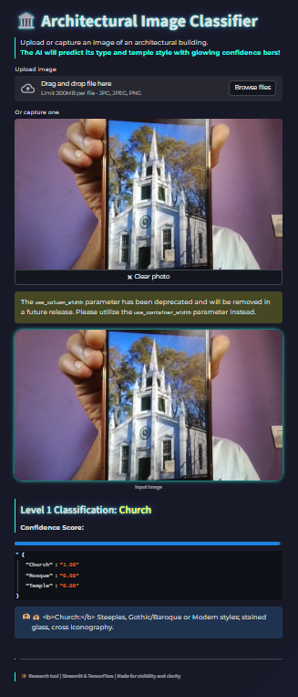

# 🧠 System Architecture

The application follows a multi-stage AI pipeline:

1. **Image Input**
   - User uploads or captures an architectural image

2. **Preprocessing**
   - Image resizing
   - Normalization
   - Noise reduction

3. **Level 1 Model**
   - CNN classifier
   - Predicts:
        Church
        Mosque
        Temple

4. **Level 2 Model**
   - Activated only if prediction = Temple
   - Classifies:
        Dravidian
        Nagara

5. **Prediction Layer**
   - Softmax probabilities
   - Confidence score visualization

6. **User Interface**
   - Streamlit dashboard
   - Prediction explanation
  
# 🧪 Model Training

## Data Preprocessing

The images were preprocessed using:

- Image resizing: 224 × 224
- Pixel normalization
- Data augmentation

Techniques used:

- Rotation
- Horizontal flip
- Zoom
- Brightness adjustment

## Training Details

Model: Convolutional Neural Network (CNN)

Training parameters:

Epochs: 20–50  
Batch Size: 32  
Optimizer: Adam  
Loss Function: Categorical Crossentropy  

## Evaluation Metrics

Accuracy  
Precision  
Recall  
F1 Score

# 📊 Model Performance

| Model | Accuracy |
|------|------|
| Architecture Classifier | 92% |
| Temple Style Classifier | 89% |

The model performs well in identifying architectural features such as:

- Towers
- Domes
- Sculptures
- Structural symmetry
# 🖼️ Application Demo

## 🖼 Application Demo

### Church Detection

---

### Dravidian Temple Detection

---

### Nagara Temple Detection

##Requirements 
Create requirements.txt
streamlit
tensorflow
keras
opencv-python
numpy
pillow
matplotlib
scikit-learn

##install with 

pip install -r requirements.txt

# Data_set 

https://drive.google.com/drive/folders/1LbzF0nsc0NqjqXjtO9bMaDa-Hy9BqfNk?usp=sharing

