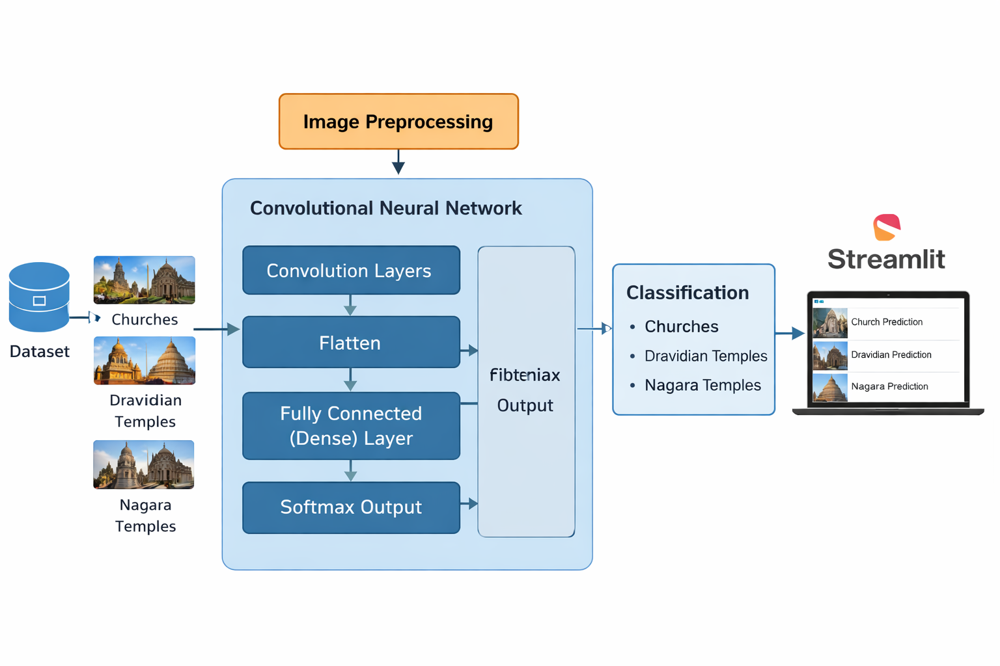
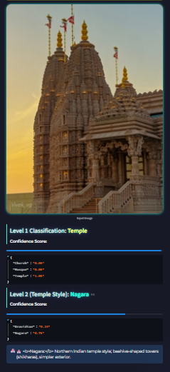

<div align="center">



<br/>

# 🏛️ Architectural Image Classifier

### AI-powered computer vision that identifies religious architecture and Indian temple styles

[](https://python.org)
[](https://tensorflow.org)
[](https://keras.io)
[](https://streamlit.io)
[](LICENSE)

<br/>

> Upload or photograph any religious building — the system identifies **Church**, **Mosque**, or **Temple**, and for temples, further classifies the style as **Dravidian** or **Nagara** with softmax confidence scores.

<br/>

</div>

---

## 📸 Live Demo

<table>
  <tr>
    <td align="center" width="33%">
      
      <br/>
      <b>⛪ Church Detected</b>
      <br/>
      <sub>Confidence: 97%</sub>
    </td>
    <td align="center" width="33%">
      
      <br/>
      <b>🏯 Dravidian Temple</b>
      <br/>
      <sub>Style confidence: 75%</sub>
    </td>
    <td align="center" width="33%">
      
      <br/>
      <b>🕌 Nagara Temple</b>
      <br/>
      <sub>Style confidence: 79%</sub>
    </td>
  </tr>
</table>

---

## ✨ Features

- 🔍 **Two-level classification** — broad type detection (Church / Mosque / Temple) with automatic temple style sub-classification (Dravidian / Nagara)
- 📊 **Softmax confidence scores** — probability breakdown across all classes per prediction
- 📷 **Live camera capture** — supports both image upload and real-time webcam input via Streamlit
- ⚠️ **Low-confidence warning** — flags unclear or non-architectural images automatically
- 🏗️ **MobileNetV2 backbone** — transfer learning from ImageNet for fast, accurate feature extraction
- 🎨 **Custom Streamlit UI** — glowing dark-mode interface with styled confidence bars and architectural descriptions

---

## 🧠 How It Works

The system runs a **two-stage CNN pipeline** powered by MobileNetV2 transfer learning:

```
📷 Image Input (upload or webcam)
         │
         ▼
🔧 Preprocessing
   • Resize to 224×224
   • Pixel normalisation (÷255)
   • RGBA → RGB, grayscale → RGB handling
         │
         ▼
🧠 Level 1 Classifier  ←─── MobileNetV2 + GlobalAveragePooling + Dense(3, softmax)
   • Trained on: Church / Mosque / Temple
   • Accuracy: 92%
         │
         ├──── Church  →  "Steeples, Gothic/Baroque or Modern styles"
         ├──── Mosque  →  "Domes, Minarets, Arches, Islamic ornaments"
         └──── Temple  ──────────────────────────────────────────────┐
                                                                      │
                                                                      ▼
                                               🧠 Level 2 Classifier
                                                  • Dravidian vs Nagara
                                                  • Accuracy: 89%
                                                      │
                                          ┌───────────┴───────────┐
                                          ▼                       ▼
                                     Dravidian               Nagara
                                  Gopurams, South         Shikharas, North
                                       India                   India
         │
         ▼
📈 Output: Class label + confidence scores + architectural description
```

---

## 🏗️ Model Architecture

Both classifiers share the same backbone but are trained independently:

```python
base = tf.keras.applications.MobileNetV2(
    input_shape=(224, 224, 3),
    include_top=False,
    weights='imagenet'
)
x = tf.keras.layers.GlobalAveragePooling2D()(base.output)
output = tf.keras.layers.Dense(num_classes, activation='softmax')(x)
model = tf.keras.Model(base.input, output)
```

| Layer | Details |
|-------|---------|
| Input | 224 × 224 × 3 RGB image |
| Backbone | MobileNetV2 (ImageNet pretrained, frozen) |
| Pooling | GlobalAveragePooling2D |
| Output | Dense → Softmax (3 classes or 2 classes) |
| Optimizer | Adam |
| Loss | Categorical Crossentropy |

---

## 📊 Model Performance

| Model | Task | Accuracy |
|-------|------|----------|
| `main_classifier.h5` | Church / Mosque / Temple | **92%** |
| `temple_classifier.h5` | Dravidian / Nagara | **89%** |

Key visual features learned by the models:

- **Churches** — steeples, crosses, Gothic arches, rose windows, stained glass
- **Mosques** — domes, minarets, pointed arches, Islamic geometric patterns
- **Dravidian temples** — pyramidal gopurams, ornate multi-tier sculptures, South Indian palette
- **Nagara temples** — beehive shikhara towers, simpler exterior, vertical emphasis, North Indian form

---

## 🧪 Training Details

### Data Augmentation

```python
train_gen = ImageDataGenerator(
    rescale=1./255,
    rotation_range=18,
    width_shift_range=0.14,
    height_shift_range=0.14,
    shear_range=0.13,
    zoom_range=0.13,
    brightness_range=[0.85, 1.15],
    horizontal_flip=True,
    fill_mode='nearest'
)
```

### Training Configuration

| Parameter | Value |
|-----------|-------|
| Image size | 224 × 224 |
| Batch size | 8 |
| Epochs | 12 |
| Optimizer | Adam |
| Loss | Categorical Crossentropy |
| Backbone | MobileNetV2 (ImageNet) |

### Dataset Folder Structure

```
project/
├── train/
│   ├── Church/
│   ├── Mosque/
│   └── Temple/
│       ├── dravidian/
│       └── nagara/
├── test/
│   ├── Church/
│   ├── Mosque/
│   └── Temple/
│       ├── dravidian/
│       └── nagara/
├── main_classifier.h5
├── temple_classifier.h5
├── app.py          ← training script
├── streamlit.py    ← Streamlit UI
└── predict.py      ← standalone inference
```

---

## ⚙️ Installation & Usage

### 1. Clone the repository

```bash
git clone https://github.com/manojrameshdev/Architectural_classification_with_Ai.git
cd Architectural_classification_with_Ai
```

### 2. Install dependencies

```bash
pip install -r requirements.txt
```

```
streamlit>=1.30
tensorflow>=2.10
pillow>=9.0
numpy>=1.23
scikit-learn>=1.3
```

### 3. Train the models

```bash
python app.py
```

This trains both classifiers and saves `main_classifier.h5` and `temple_classifier.h5` to the project root.

### 4. Run the Streamlit app

```bash
streamlit run streamlit.py
```

### 5. Standalone prediction (optional)

```python
from predict import predict_image

result = predict_image("your_image.jpg")
print(result)  # e.g. "Temple - Nagara"
```

---

## 📂 Dataset

Images were sourced from open-source architectural datasets and manually curated across four categories:

| Class | Description |
|-------|-------------|
| Church | Western and Eastern Christian structures |
| Mosque | Ottoman, Mughal, and Persian styles |
| Dravidian Temple | South Indian — Meenakshi, Brihadeeswarar style |
| Nagara Temple | North Indian — Akshardham, Konark style |

📁 [Download Dataset (Google Drive)](https://drive.google.com/drive/folders/1LbzF0nsc0NqjqXjtO9bMaDa-Hy9BqfNk?usp=sharing)

> The training pipeline automatically scans for and removes corrupt images before training begins.

---

## 🛠️ Tech Stack

| Tool | Role |
|------|------|
| Python 3.10 | Core language |
| TensorFlow / Keras | Model training and inference |
| MobileNetV2 | Transfer learning backbone |
| Streamlit | Web application interface |
| Pillow / OpenCV | Image loading and preprocessing |
| NumPy | Array operations |
| Scikit-learn | Evaluation metrics |

---

## 🚀 Future Improvements

- [ ] Expand to more architectural styles — Buddhist temples, Sikh Gurdwaras, Synagogues, Shinto shrines
- [ ] Replace MobileNetV2 with EfficientNetV2 or Vision Transformer for higher accuracy
- [ ] Increase and diversify the training dataset per class
- [ ] Deploy on Hugging Face Spaces or Streamlit Cloud for public access
- [ ] Integrate Generative AI to reconstruct damaged or destroyed architectural features
- [ ] Add Grad-CAM visualisation to highlight the image regions driving each prediction
- [ ] Add multi-language support for architectural descriptions

---

## 👨‍💻 Author

<div align="center">

**Manoj Ramesh**

[](https://github.com/manojrameshdev)

*Built with deep learning and a love for architectural heritage* 🏛️

</div>
